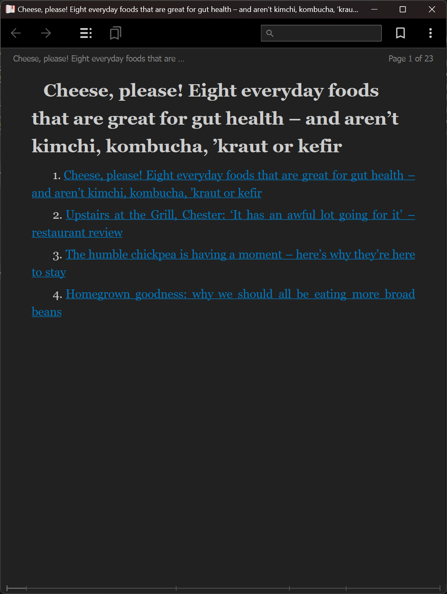
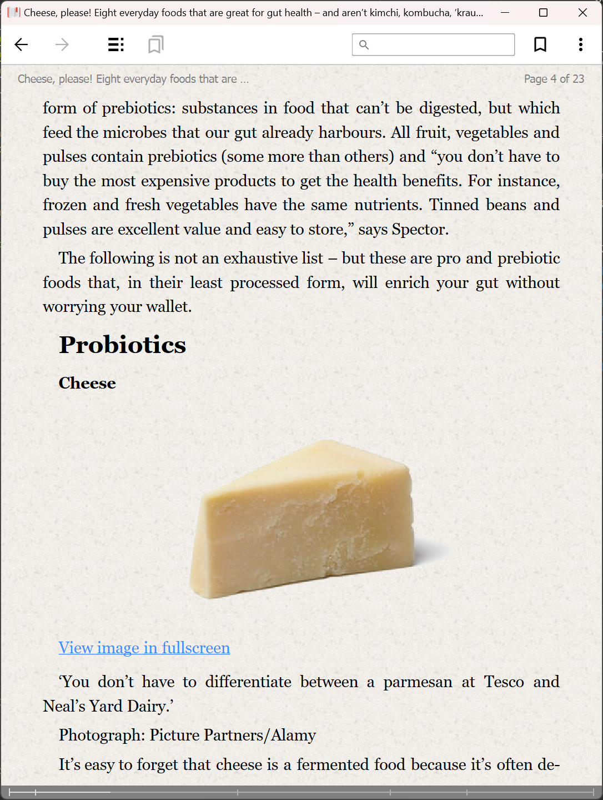
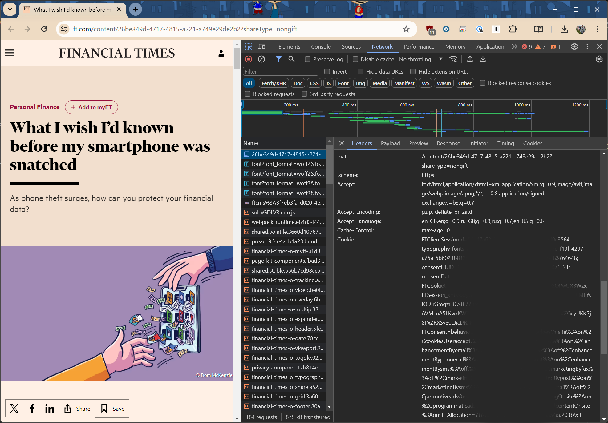

# artpub: ARTicle to ePUB

This is a simple script which helps to convert multiple online articles into a
single epub file, which is suitable for eReaders.

Here's an example for a website which doesn't require sign-in:

```bash

$ (test) [sgzmd@RK:code/artpub]$ ./artpub.py --url \
    https://www.theguardian.com/food/article/2024/may/12/cheese-please-eight-everyday-foods-that-are-great-for-gut-health-and-arent-kimchi-kombucha-kraut-or-kefir \
    https://www.theguardian.com/food/article/2024/may/12/upstairs-at-the-grill-chester-it-has-an-awful-lot-going-for-it-restaurant-review \
    https://www.theguardian.com/better-baskets/2024/apr/25/the-humble-chickpea-is-having-a-moment-heres-why-theyre-here-to-stay \
    https://www.theguardian.com/better-baskets/2024/apr/25/homegrown-goodness-why-we-should-all-be-eating-more-broad-beans \
    --out_dir=./guardian

$ (test) [sgzmd@RK:code/artpub]$ ls ./guardian
Cheese,_please!_Eight_everyday_foods_that_are_great_for_gut_health_–_and_aren’t_kimchi,_kombucha,_’kraut_or_kefir.epub
```

With some luck, this should produce an output not unlike below:



Navigating to the article page should present an article text only (and
hopefully some images but honestly YMMV):



Things get a bit tricky when you the website requires sign-in. We assume that
you have a legitimate account and you're using this script for personal use only
and not for sharing copyrighted material.



Copy the entire cookie content from Request Headers option in the Network tab of
the [Developer
Tools](https://developers.google.com/web/tools/chrome-devtools/network/reference#headers)
in Chrome. Then, add it as a cookie argument to the script:

```bash
$ (test) [sgzmd@RK:code/artpub]$ ./artpub.py --url \
    https://www.ft.com/content/1b2c3d4e-5f6g-7h8i-9j0k-1l2m3n4o5p6 \
    --out_dir=./ft --cookie="cookie1=value1; cookie2=value2; ..."
```

You will find that image extraction is sporadic - top image on many websites is
not extracted properly. Broadly, it only works on plain old ``
tags, and everything fancy confuses the script.

## Acknowledgements

This script was made possible with:

- [BeautifulSoup](https://www.crummy.com/software/BeautifulSoup/): Library for pulling data out of HTML and XML files. Thanks to Leonard Richardson for creating and maintaining this library.
- [lxml](https://lxml.de/): Library for processing XML and HTML. Thanks to the lxml project team for creating and maintaining this library.
- [ebooklib](https://github.com/aerkalov/ebooklib): Library for handling EPUB2/EPUB3 and Kindle format. Thanks to Aleksandar Erkalovic for creating and maintaining this library.
- [newspaper](https://github.com/codelucas/newspaper): Library for extracting & curating articles. Thanks to Lucas Ou-Yang for creating and maintaining this library.
- [magic](https://github.com/ahupp/python-magic): Library for identifying data types. Thanks to Adam Hupp for creating and maintaining this library.
- [requests](https://docs.python-requests.org/en/latest/): Library for making HTTP requests. Thanks to Kenneth Reitz for creating this library and to the maintainers for their continued work.